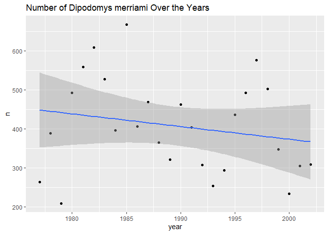

## Instructions
Answer the following questions and complete the exercises in RMarkdown. Please embed all of your code and push your final work to your repository. Your final lab report should be organized, clean, and run free from errors. Remember, you must remove the `#` for the included code chunks to run. Be sure to add your name to the author header above. For any included plots, make sure they are clearly labeled. You are free to use any plot type that you feel best communicates the results of your analysis.  

Make sure to use the formatting conventions of RMarkdown to make your report neat and clean!  

## Load the libraries

```r
library(tidyverse)
library(janitor)
library(here)
library(naniar)
```

## Desert Ecology
For this assignment, we are going to use a modified data set on [desert ecology](http://esapubs.org/archive/ecol/E090/118/). The data are from: S. K. Morgan Ernest, Thomas J. Valone, and James H. Brown. 2009. Long-term monitoring and experimental manipulation of a Chihuahuan Desert ecosystem near Portal, Arizona, USA. Ecology 90:1708.

```r
deserts <- read_csv(here("lab10", "data", "surveys_complete.csv"))
```

```
## 
## -- Column specification --------------------------------------------------------
## cols(
##   record_id = col_double(),
##   month = col_double(),
##   day = col_double(),
##   year = col_double(),
##   plot_id = col_double(),
##   species_id = col_character(),
##   sex = col_character(),
##   hindfoot_length = col_double(),
##   weight = col_double(),
##   genus = col_character(),
##   species = col_character(),
##   taxa = col_character(),
##   plot_type = col_character()
## )
```

1. Use the function(s) of your choice to get an idea of its structure, including how NA's are treated. Are the data tidy?  

```r
glimpse(deserts)
```

```
## Rows: 34,786
## Columns: 13
## $ record_id       <dbl> 1, 2, 3, 4, 5, 6, 7, 8, 9, 10, 11, 12, 13, 14, 15, ...
## $ month           <dbl> 7, 7, 7, 7, 7, 7, 7, 7, 7, 7, 7, 7, 7, 7, 7, 7, 7, ...
## $ day             <dbl> 16, 16, 16, 16, 16, 16, 16, 16, 16, 16, 16, 16, 16,...
## $ year            <dbl> 1977, 1977, 1977, 1977, 1977, 1977, 1977, 1977, 197...
## $ plot_id         <dbl> 2, 3, 2, 7, 3, 1, 2, 1, 1, 6, 5, 7, 3, 8, 6, 4, 3, ...
## $ species_id      <chr> "NL", "NL", "DM", "DM", "DM", "PF", "PE", "DM", "DM...
## $ sex             <chr> "M", "M", "F", "M", "M", "M", "F", "M", "F", "F", "...
## $ hindfoot_length <dbl> 32, 33, 37, 36, 35, 14, NA, 37, 34, 20, 53, 38, 35,...
## $ weight          <dbl> NA, NA, NA, NA, NA, NA, NA, NA, NA, NA, NA, NA, NA,...
## $ genus           <chr> "Neotoma", "Neotoma", "Dipodomys", "Dipodomys", "Di...
## $ species         <chr> "albigula", "albigula", "merriami", "merriami", "me...
## $ taxa            <chr> "Rodent", "Rodent", "Rodent", "Rodent", "Rodent", "...
## $ plot_type       <chr> "Control", "Long-term Krat Exclosure", "Control", "...
```

```r
names(deserts)
```

```
##  [1] "record_id"       "month"           "day"             "year"           
##  [5] "plot_id"         "species_id"      "sex"             "hindfoot_length"
##  [9] "weight"          "genus"           "species"         "taxa"           
## [13] "plot_type"
```

```r
deserts %>% 
    summarise_all(~(sum(is.na(.))))
```

```
## # A tibble: 1 x 13
##   record_id month   day  year plot_id species_id   sex hindfoot_length weight
##       <int> <int> <int> <int>   <int>      <int> <int>           <int>  <int>
## 1         0     0     0     0       0          0  1748            3348   2503
## # ... with 4 more variables: genus <int>, species <int>, taxa <int>,
## #   plot_type <int>
```

```r
deserts
```

```
## # A tibble: 34,786 x 13
##    record_id month   day  year plot_id species_id sex   hindfoot_length weight
##        <dbl> <dbl> <dbl> <dbl>   <dbl> <chr>      <chr>           <dbl>  <dbl>
##  1         1     7    16  1977       2 NL         M                  32     NA
##  2         2     7    16  1977       3 NL         M                  33     NA
##  3         3     7    16  1977       2 DM         F                  37     NA
##  4         4     7    16  1977       7 DM         M                  36     NA
##  5         5     7    16  1977       3 DM         M                  35     NA
##  6         6     7    16  1977       1 PF         M                  14     NA
##  7         7     7    16  1977       2 PE         F                  NA     NA
##  8         8     7    16  1977       1 DM         M                  37     NA
##  9         9     7    16  1977       1 DM         F                  34     NA
## 10        10     7    16  1977       6 PF         F                  20     NA
## # ... with 34,776 more rows, and 4 more variables: genus <chr>, species <chr>,
## #   taxa <chr>, plot_type <chr>
```
*This data is not tidy.* 
2. How many genera and species are represented in the data? What are the total number of observations? Which species is most/ least frequently sampled in the study?

```r
deserts %>% 
  count(genus, species, sort=T) 
```

```
## # A tibble: 48 x 3
##    genus           species          n
##    <chr>           <chr>        <int>
##  1 Dipodomys       merriami     10596
##  2 Chaetodipus     penicillatus  3123
##  3 Dipodomys       ordii         3027
##  4 Chaetodipus     baileyi       2891
##  5 Reithrodontomys megalotis     2609
##  6 Dipodomys       spectabilis   2504
##  7 Onychomys       torridus      2249
##  8 Perognathus     flavus        1597
##  9 Peromyscus      eremicus      1299
## 10 Neotoma         albigula      1252
## # ... with 38 more rows
```

```r
deserts %>% 
  select(genus, species) %>% 
  summarize(total=n())
```

```
## # A tibble: 1 x 1
##   total
##   <int>
## 1 34786
```

```r
deserts %>% 
  count(species, sort=T) %>% 
  head(n=1)
```

```
## # A tibble: 1 x 2
##   species      n
##   <chr>    <int>
## 1 merriami 10596
```

```r
deserts %>% 
  count(species, sort=T) %>% 
  tail(n=1)
```

```
## # A tibble: 1 x 2
##   species     n
##   <chr>   <int>
## 1 viridis     1
```
*Species merriami is sampled the most and species viridis is sampled the least.*

3. What is the proportion of taxa included in this study? Show a table and plot that reflects this count.

```r
deserts %>% 
  count(taxa, sort=T)
```

```
## # A tibble: 4 x 2
##   taxa        n
##   <chr>   <int>
## 1 Rodent  34247
## 2 Bird      450
## 3 Rabbit     75
## 4 Reptile    14
```

```r
deserts %>% 
  ggplot(aes(x = taxa)) + geom_bar() + scale_y_log10() +
  coord_flip() +
  labs(title = "Proportion of Taxa in Deserts Data",
       x = "Taxonomic Group",
       fill = "taxa")
```

<!-- -->

4. For the taxa included in the study, use the fill option to show the proportion of individuals sampled by `plot_type.`

```r
deserts %>% 
 ggplot(aes(x = taxa, fill=plot_type)) + geom_bar() + scale_y_log10() +
  coord_flip() +
  labs(title = "Proportion of Taxa in Deserts Data",
       x = "Taxonomic Group",
       fill = "plot_type")
```

<!-- -->

5. What is the range of weight for each species included in the study? Remove any observations of weight that are NA so they do not show up in the plot.

```r
deserts %>% 
  group_by(species) %>% 
  filter(weight!="NA") %>%
  ggplot(aes(x=species, y=weight, color = species)) +
  geom_boxplot(na.rm=T) + coord_flip()+
  labs(title="Range of Weight for Different Species", x="species", y="weight")
```

<!-- -->

6. Add another layer to your answer from #5 using `geom_point` to get an idea of how many measurements were taken for each species.

```r
deserts%>%
  group_by(species) %>% 
  filter(weight!="NA") %>%
  ggplot(aes(x=species, y=weight, color = species)) +
  geom_boxplot(na.rm=T) + coord_flip()+
  geom_point(size=0.5)+
  theme(axis.text.x = element_text(angle = 60, hjust = 1))+
  labs(title = "Weight Measurements per Species",x="Species",y="Number of Weight Measurements")
```

<!-- -->

7. [Dipodomys merriami](https://en.wikipedia.org/wiki/Merriam's_kangaroo_rat) is the most frequently sampled animal in the study. How have the number of observations of this species changed over the years included in the study?

```r
deserts %>% 
  filter(genus=="Dipodomys", species=="merriami") %>% 
  count(genus, species, year) 
```

```
## # A tibble: 26 x 4
##    genus     species   year     n
##    <chr>     <chr>    <dbl> <int>
##  1 Dipodomys merriami  1977   264
##  2 Dipodomys merriami  1978   389
##  3 Dipodomys merriami  1979   209
##  4 Dipodomys merriami  1980   493
##  5 Dipodomys merriami  1981   559
##  6 Dipodomys merriami  1982   609
##  7 Dipodomys merriami  1983   528
##  8 Dipodomys merriami  1984   396
##  9 Dipodomys merriami  1985   667
## 10 Dipodomys merriami  1986   406
## # ... with 16 more rows
```

```r
deserts %>% 
  filter(genus=="Dipodomys", species=="merriami") %>% 
  count(genus, species, year) %>% 
  ggplot(aes(x=year, y=n))+geom_point()+
  labs(title="Number of Dipodomys merriami Over the Years", x="year", y="n")+geom_smooth(method="lm", na.rm=T)
```

```
## `geom_smooth()` using formula 'y ~ x'
```

<!-- -->
*This isn't very conclusive data that the number of observations has changed over the years.* 

8. What is the relationship between `weight` and `hindfoot` length? Consider whether or not over plotting is an issue.

```r
deserts %>% 
  ggplot(aes(x=weight, y=hindfoot_length))+geom_point(size=0.25,alpha=0.5,na.rm=T)+labs(title = "Weight vs. Hindfoot Length")+geom_smooth(method="lm", na.rm=T)
```

```
## `geom_smooth()` using formula 'y ~ x'
```

<!-- -->
*I think overplotting is an issue here. It is hard to distinguish data points even when I reduce their size.*

9. Which two species have, on average, the highest weight? Once you have identified them, make a new column that is a ratio of `weight` to `hindfoot_length`. Make a plot that shows the range of this new ratio and fill by sex.

```r
deserts %>% 
  filter(weight!="NA") %>% 
  group_by(species) %>% 
  summarize(mean_wt=mean(weight, na.rm=T)) %>% 
  arrange(desc(mean_wt)) %>% 
  head(n=2)
```

```
## # A tibble: 2 x 2
##   species     mean_wt
##   <chr>         <dbl>
## 1 albigula       159.
## 2 spectabilis    120.
```

```r
deserts %>% 
    filter(species=="albigula"|species=="spectabilis") %>% 
  mutate(ratio_w_hl=weight/hindfoot_length)
```

```
## # A tibble: 3,756 x 14
##    record_id month   day  year plot_id species_id sex   hindfoot_length weight
##        <dbl> <dbl> <dbl> <dbl>   <dbl> <chr>      <chr>           <dbl>  <dbl>
##  1         1     7    16  1977       2 NL         M                  32     NA
##  2         2     7    16  1977       3 NL         M                  33     NA
##  3        11     7    16  1977       5 DS         F                  53     NA
##  4        17     7    16  1977       3 DS         F                  48     NA
##  5        20     7    17  1977      11 DS         F                  48     NA
##  6        22     7    17  1977      15 NL         F                  31     NA
##  7        30     7    17  1977      10 DS         F                  52     NA
##  8        38     7    17  1977      17 NL         M                  33     NA
##  9        42     7    18  1977      18 DS         F                  46     NA
## 10        58     7    18  1977      12 DS         M                  45     NA
## # ... with 3,746 more rows, and 5 more variables: genus <chr>, species <chr>,
## #   taxa <chr>, plot_type <chr>, ratio_w_hl <dbl>
```

```r
deserts %>% 
  filter(sex!="NA",weight!="NA",hindfoot_length!="NA") %>% 
    filter(species=="albigula"|species=="spectabilis") %>% 
  mutate(ratio_w_hl=weight/hindfoot_length) %>% 
  ggplot(aes(x=species, y=ratio_w_hl, fill=sex))+geom_boxplot(na.rm=T)+
  labs(title="Sex vs Weight/Hindfoot Length Ratio for albigula and spectabilis", x="Species", y="Weight/Hindfoot Length Ratio")
```

<!-- -->

10. Make one plot of your choice! Make sure to include at least two of the aesthetics options you have learned.

```r
deserts %>% 
  filter(sex!="NA") %>% 
    ggplot(aes(x=species, fill=sex))+ geom_bar()+ coord_flip()+
  labs(title = "Sex Proportion Per Species",
       x = "species",
       y = "n",
       fill = "weight")
```

<!-- -->

```r
  theme(plot.title = element_text(size = rel(1.5), hjust = 0.5))
```

```
## List of 1
##  $ plot.title:List of 11
##   ..$ family       : NULL
##   ..$ face         : NULL
##   ..$ colour       : NULL
##   ..$ size         : 'rel' num 1.5
##   ..$ hjust        : num 0.5
##   ..$ vjust        : NULL
##   ..$ angle        : NULL
##   ..$ lineheight   : NULL
##   ..$ margin       : NULL
##   ..$ debug        : NULL
##   ..$ inherit.blank: logi FALSE
##   ..- attr(*, "class")= chr [1:2] "element_text" "element"
##  - attr(*, "class")= chr [1:2] "theme" "gg"
##  - attr(*, "complete")= logi FALSE
##  - attr(*, "validate")= logi TRUE
```

## Push your final code to GitHub!
Please be sure that you check the `keep md` file in the knit preferences. 
